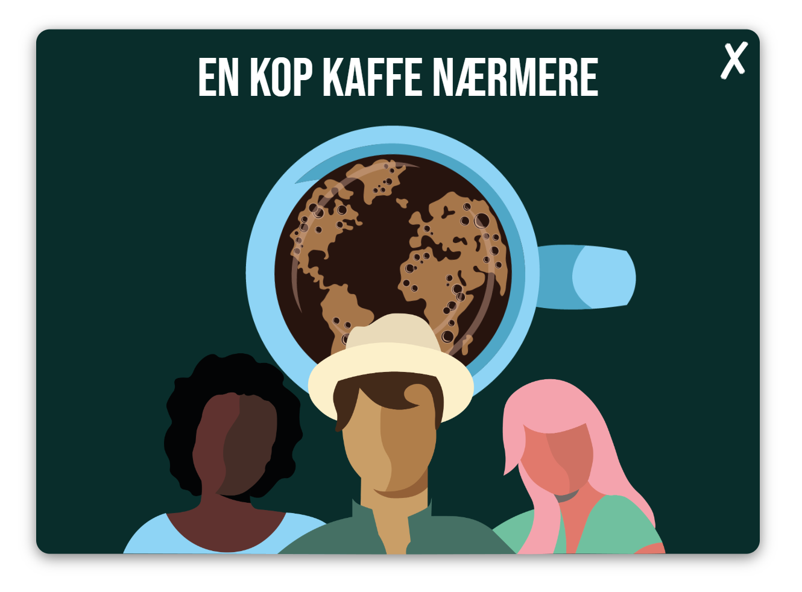
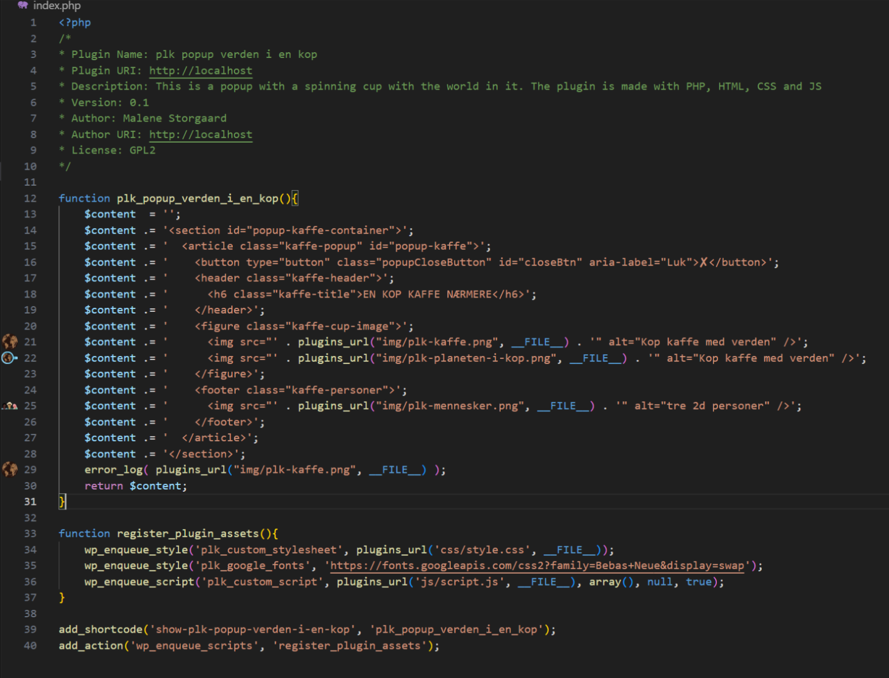
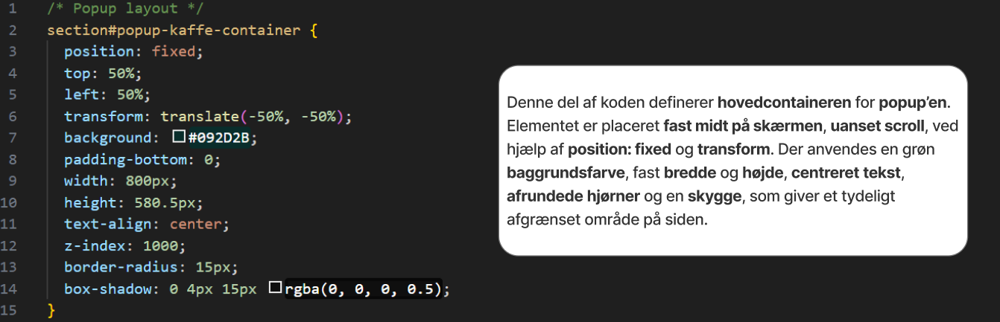
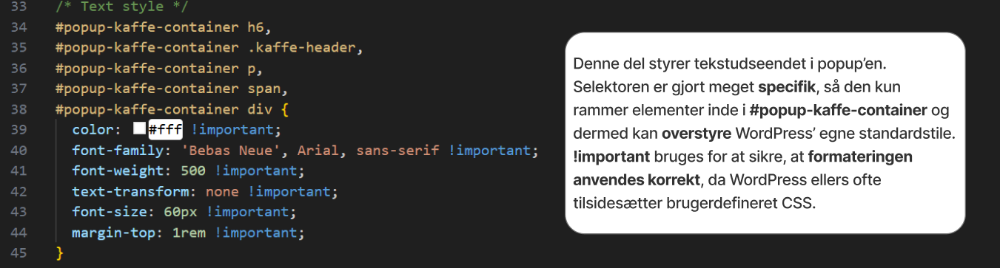
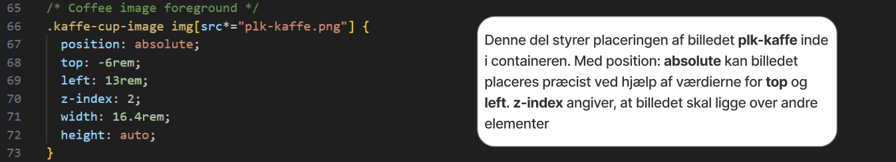
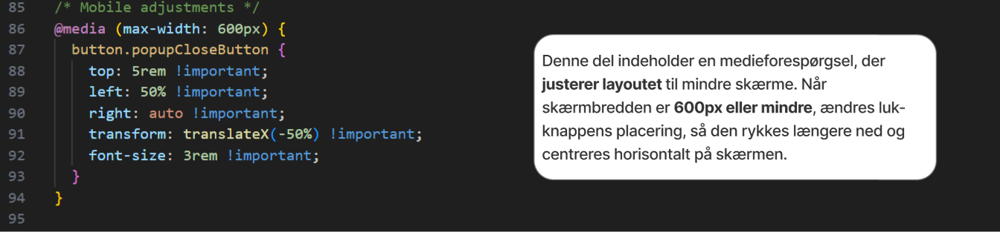
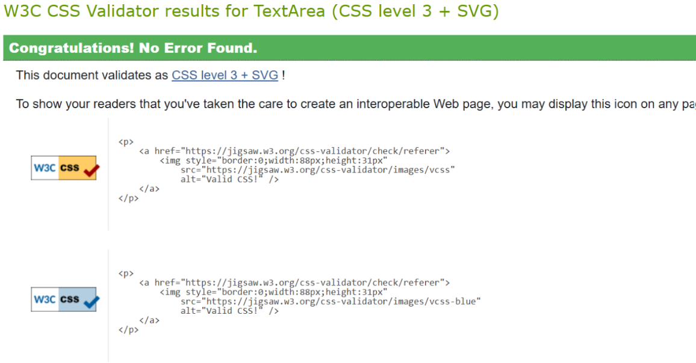
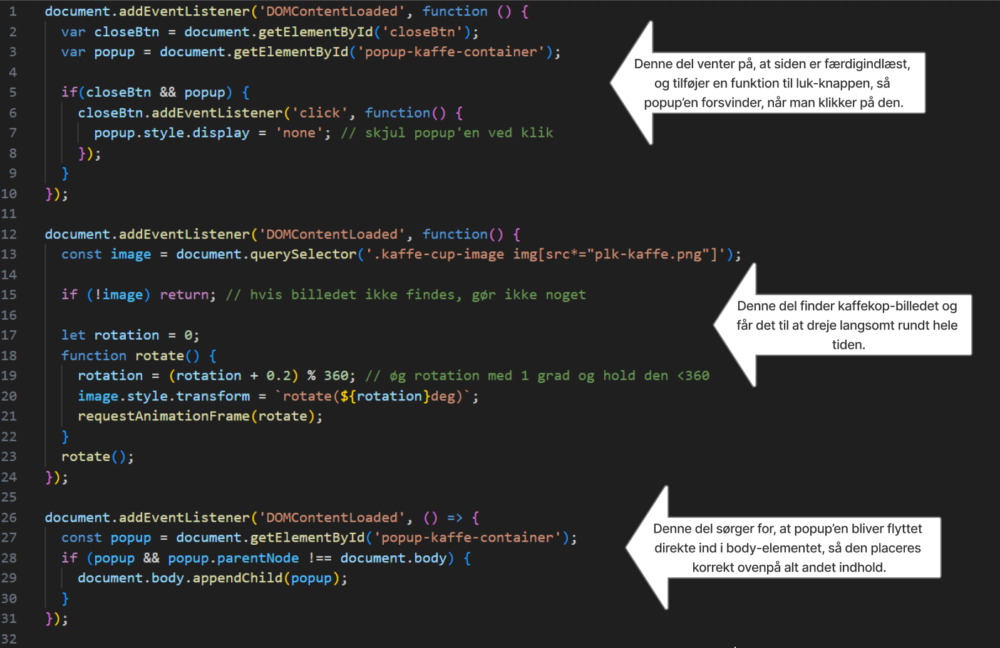
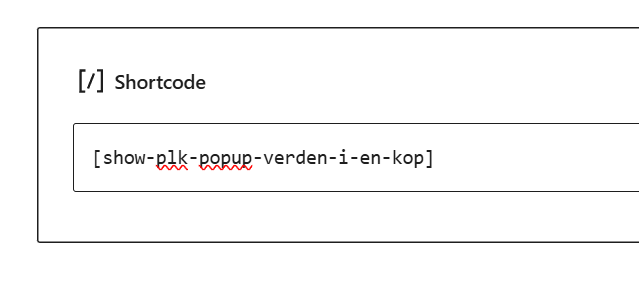

# plk-popup-verden-i-en-kop

## Formålet med plugin

Formålet med mit plugin var at skabe noget interessant, som gjorde det mere spændende at følge vores løsning eller kampagne. Jeg blev inspireret af en idé fra et af vores moodboards, hvor der var et billede af verden i en kop. Ud fra dette opstod tanken om at lade koppen dreje, så der var et visuelt spændende element at se på i stedet for et statisk billede. Da jeg begyndte at sætte elementerne sammen i koden, fik jeg en endnu bedre idé: at få kaffen inde i koppen til at dreje rundt, da det ville give et pænere og mere stilrent visuelt udtryk.

Derudover har jeg designet de tre personer i plugin'et ud fra Peter Larsen Kaffes egen visuelle stil, så der er en tydelig sammenhæng. Det samme gælder valget af font og baggrundsfarve i plugin'et. Mit overordnede mål var, at det skulle ligne noget, Peter Larsen Kaffe selv kunne have lavet.

___
## Opbygning af HTML, CSS, JS og PHP

### HTML i PHP

Øverst i filen findes en **kommentarblok**, der indeholder **metadata** om plugin’et som **navn**, **version** og **forfatter**. Denne information er nødvendig for, at WordPress kan genkende plugin’et og vise **relevante oplysninger i admin-panelet**.

**Hovedfunktionen** `plk_popup_verden_i_en_kop` bygger popup’ens HTML. I stedet for at skrive HTML direkte i en fil bruges `$content = "";` til at samle HTML-strenge i PHP. `$content .=` tilføjer linje for linje HTML til variablen, som til sidst returneres. Dette gør det muligt at **generere dynamisk HTML, der kan indsættes hvor som helst via shortcode**, og sikrer, at det kan **håndteres af WordPress uden en statisk HTML-fil**.

Funktionen `register_plugin_assets` sikrer, at CSS og JS indlæses korrekt. `wp_enqueue_style` og `wp_enqueue_script` tilføjer eksterne filer til siden på en måde, der er **kompatibel med WordPress’ system**, så stilarter og scripts ikke bliver overskrevet af temaet.

`add_shortcode` **registrerer popup’en som en shortcode**, så den kan indsættes i indhold på en side eller i et indlæg.

`add_action('wp_enqueue_scripts', ...)` fortæller WordPress, at **CSS og JS skal indlæses, når siden vises.**
___
### CSS

Mit CSS styrer **udseendet**, **placeringen** og **lagene** i popup-vinduet til mit WordPress-plugin. Jeg har valgt at **centrere popup’en** på siden og give den en **mørk baggrund**, **afrundede hjørner** og en **skyggeeffekt**, **så indholdet bliver fremhævet.**

Under arbejdet havde jeg **udfordringer** med **størrelsen** på pluginnet og **placeringen** af de forskellige elementer, hvor jeg måtte **justere bredde og højde** manuelt for at få layoutet til at passe både til **billeder** og **tekst**. Det var også en **udfordring at style teksten** – ofte blev min **CSS overskrevet af WordPress’ tema** eller **andre plugins**, indtil jeg brugte `!important` for at få mine regler igennem.

**Lukke-knappen (X)** gav mig også **problemer**, for **hitboksen** virkede ikke altid, så det var til tider svært at lukke popuppen. **Løsningen** blev at **justere position**, **størrelse** og **z-index** indtil knappen fungerede som forventet, men på nogle computere skulle man stadig scrolle en smule for at få lov at lukke den.

Mit plugin er desværre **ikke helt responsivt** – hvis man åbner popuppen på en mobil, kunne man ikke altid lukke den. For at afhjælpe det, har jeg **flyttet lukke-knappen** med en `@media-regel`, så den kommer til syne på mindre skærme.

**Overordnet** har mit CSS gjort popup-vinduet mere **brugervenligt** og **visuelt sammenhængende**, men jeg har også oplevet typiske udfordringer med WordPress’ styling, og har **løbende rettet og tilpasset koden for at få alt til at spille så godt som muligt.**

Jeg har valideret mit CSS

___
### JS

Mit **JavaScript styrer tre ting** i mit plugin:

- **Lukke-knappen**, så brugeren kan skjule popup’en ved klik.

- **Rotation af kaffebilledet** inde i popup’en, som giver en dynamisk effekt.

- At **popup-elementet altid placeres korrekt i DOM’en**, så det vises stabilt på siden.

Det gør popup’en både **funktionel** og **visuelt interessant**, samtidig med at jeg sikrer **god brugeroplevelse** og **undgår fejl** på tværs af forskellige browsere og temaer.

Mit JavaScript **kører først**, når hele siden er indlæst, takket være `DOMContentLoaded`-eventet.

Det første script finder **lukke-knappen** og **popup-elementet** ved deres **id’er**. Når brugeren klikker på lukke-knappen, **skjuler** jeg **popup’en ved at sætte dens `display`-stil til `none`**. Det gør, at popup’en forsvinder fra visningen, uden at siden skal genindlæses.

Det næste script **roterer kaffebilledet inde i popup’en**. Det bruger en **funktion**, der øger en **rotationsvinkel** lidt ad gangen, og opdatere billedets CSS-transform med denne vinkel. Funktionen kaldes løbende med `requestAnimationFrame`, som sikrer en **jævn** og **optimeret animation** i browseren. Hvis billedet ikke findes, stopper funktionen automatisk for at undgå fejl.

Det sidste script sikrer, at **popup-elementet altid er et direkte barn af `<body>`**. Det gør, at popuppen ikke bliver fanget inde i andre elementer, som kan forstyrre visningen eller funktionaliteten.

Sammen sikrer disse scripts, at **popup’en vises stabilt**, kan lukkes nemt af brugeren, og samtidig har en flot, roterende visuel effekt.
___

## Shortcode i wordpress

Mit plugin aktiveres via shortcoden `[show-plk-popup-verden-i-en-kop]`, som jeg har registreret i koden. Når man indsætter denne shortcode i en side eller et indlæg, kaldes en funktion automatisk, som indsætter popup’ens HTML. Det gør det nemt at vise popup’en hvor som helst uden at ændre i temaets filer. Shortcodes gør det altså enkelt at tilføje dynamisk indhold via en simpel tekstkode.

___

## Kilder

Kilde:
OpenAI, 2024. hjælp med kode  [online] Fundet på: [hjælp med kode](https://www.perplexity.ai/search/hjaelp-med-kode-epnIaWAeSHW3WocJTQ42Vw#12) [set 31-10-2025]